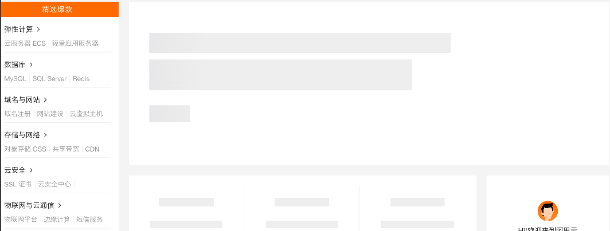

# 优化

### 一、性能优化

- 01、DocumentFragment
- 02、innerHtml
- 03、使用局部变量
- 04、避免闭包内存泄漏
- 05、使用while循环
- 06、字面量代替构造函数
- 07、===代替==
- 08、switch代替if
- 09、避免使用eval

### 二、网络优化

#### 01、压缩代码

生产环境的代码充满许多空格换行，长长的函数、变量名称等都是很占文件的空间。这时可以考虑压缩代码来减少文件的体积，来时在加载文件时提高速度！例如：

压缩前
```javascript
function test(number, number1) {
  if (number && number1) {
    var count = number + number1 * number
    console.log(count);
    return count;
  }
}
```

压缩后
```javascript
function test(t,n){if(t&&n){var r=t+n*t;return r}}
```
可以看到`test`函数中参数将会变成一个简单t和n代替。相比number来讲已经减少了五六倍之多。就可以做到代码功能依旧不变，文件体积大大缩小

`css`也可以使用压缩，但是css不能像js那样替换变量名称。因为在dom中的id和class已经绑定，也就只是简单的去除换行和空格而已。

```scss
body {
  display: flex
}
// 压缩后
body{display:flex}
```

减少css代码更好的方法是定义`公共`样式，在需要使用的元素上直接绑定即可
```html
<style>
.center{
  display: flex;
  justify-content: center;
}
.font-s-20{
  font-size: 20px;
}
</style>
<div class="center font-s-20">div</div>
```

#### 02、CDN

在生产部署阶段，如果将静态资源放到自己的服务器，就需要启动一个静态服务来提供HTML中的资源访问。会产生几个问题：

- 服务器资源占用
- 带宽共享、影响接口服务
- 某些地域访问慢

解决方案

- 升级服务器的硬件
- 升级带宽

但是某些地域访问慢甚至无法访问的问题依然没有得到解决，这时候就可以采用CDN了

CDN全称内容分发网络(Content Delivery Network)。基本原理是采用多地点和多服务做缓存服务器。将这些缓存分布到用户访问比较集中的地域网络中，采用就近获取的模式。可以大大解决问题


#### 03、HTTP缓存

缓存分两种：

- 强缓存
- 协商缓存

此处省去略万行

#### 04、懒加载

懒加载也叫延迟加载，它可以在页面需要或者用户触发时才去加载图片、代码或者组件等。实现避免加载过多无用的资源，提升访问速度、节省流量和用户体验

##### 图片懒加载：

像商城页面非图片非常多，而并非所有用户都会往下拖看下面的商品信息，现在一个需求就是当用户看到商品时才去进行图片加载。也就是这个图片进入可视区时

实现：

- 在元素下有一个方法`getBoundingClientRect`，该方法返回一个对象，里面包含元素的一些信息。其中有一个`top`属性表示该元素距离浏览器顶部的距离。这个值是实时的，即可以通过这个top值来进行判断是否已经出现在可视区域

案例：

```html
<body>
<div style="height: 120vh">1</div>

</body>
<script>
  function isInView(el) {
    const top = el.getBoundingClientRect().top;
    return top <= window.innerHeight; // 图片和顶部的距离小于等于浏览器高度时，即为可视
  }
  let img = document.querySelector('img');
  window.addEventListener('scroll', function () {
    if (isInView(img)) {
      if (!img.getAttribute('src')) {
        img.setAttribute('src', img.getAttribute('_src'));
      }
    }
  });
</script>
</html>

```

##### 功能懒加载：

有时候有些业务代码可能很多，但是综合业务逻辑、该代码仅有非常一小部分的用户会去触发执行。这时候就可以考虑进行懒加载来解决。而不是每次都加载这一堆非常使用量极少的代码

实现：
- 异步加载代码可以通过动态创建`script`标签来解决

html
```html
<body>
<button>加密</button>
</body>
<script>
  function loadEncryptionScript(encryptionJSFile) {
    return new Promise(resolve => {
      let script = document.createElement('script');
      script.src = encryptionJSFile; // 该 js 在 window 中挂载加密 encryption 函数
      document.body.appendChild(script); // 插入到 dom
      script.onload = function () {
        resolve(encryption);
      };
    });
  }

  document.querySelector('button').addEventListener('click', function () {
    // 动态加载 encryption.js
    loadEncryptionScript('encryption.js')
      .then(encryption => {
        console.log(encryption('hello'));
      });
  });
</script>
</html>
```

encryption.js
```javascript
window.encryption = function (string) {
  return 'encryption ' + string;
};
```

##### 组件懒加载：

组件懒加载可以认为和功能懒加载基本差不多，组件懒加载可以通过`ajax异步`请求一个登录弹出框。一些非首要组件都可以进行懒加载，其目的是优先加载首要部分提高加载速度

#### 05、其他

- 公共代码
- 雪碧图


### 三、视觉优化

#### 01、骨架屏

骨架屏是建立在`懒加载组件`或者`异步请求`基础上做的一个优化。它可以在页面数据没有请求完展示给用户的大概结构。直到数据请求完成，才进行渲染替换骨架屏。这样可以完成视觉优化的一个效果


#### 02、数据缓存

当数据请求之后就可以考虑将数据缓存在本地，下次再请求数据之前优先读取缓存


